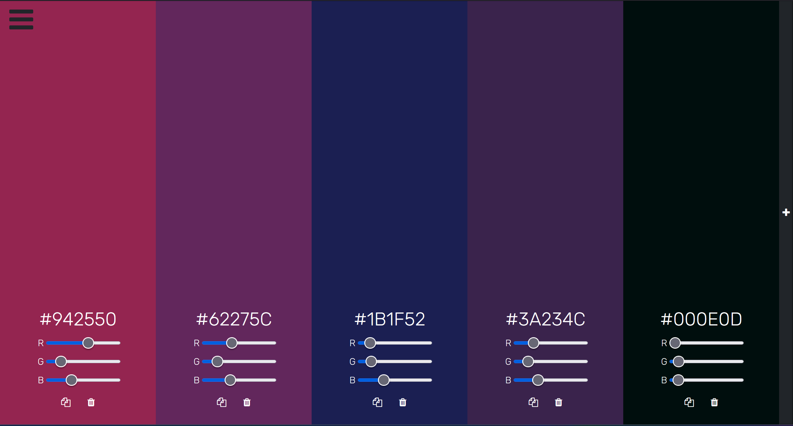
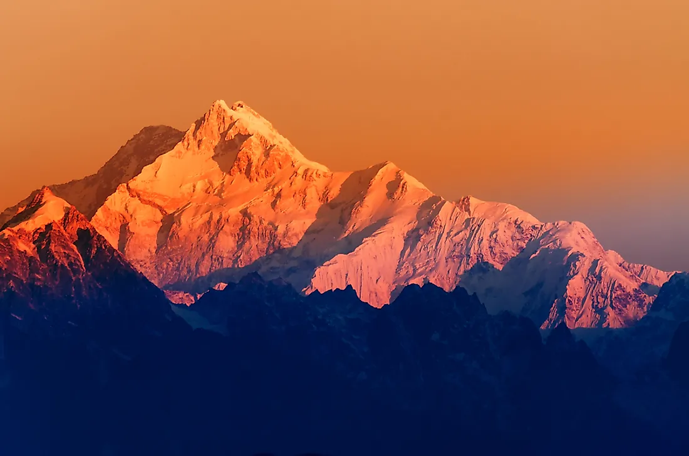
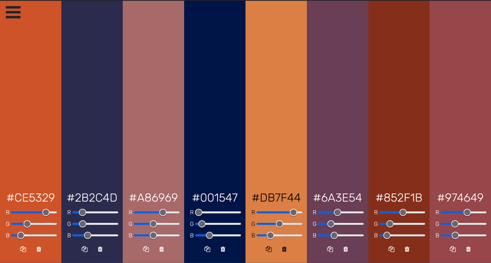
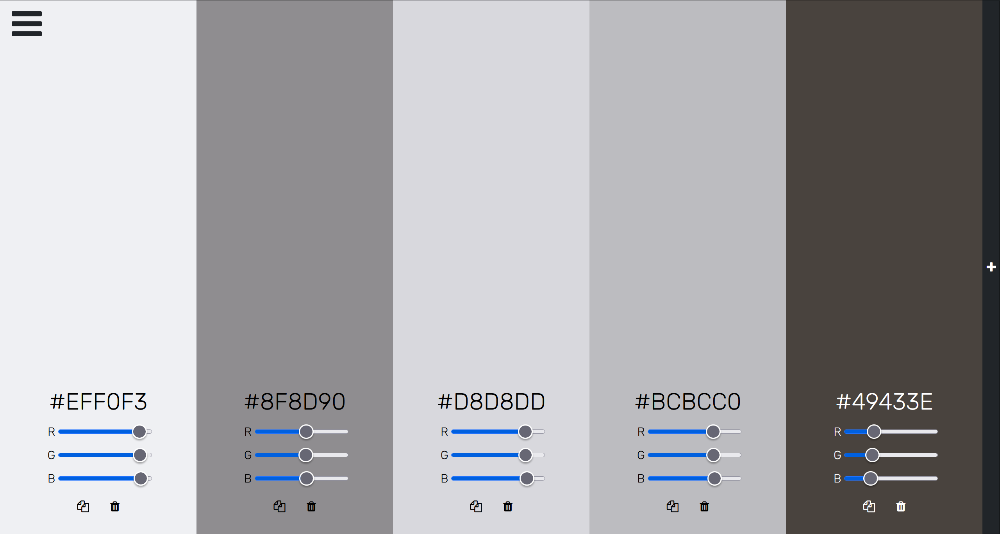

# Color Palette Generator 🎨

site: https://leslieyip02.github.io/palette/

## Algorithm ⚙️

This color palette generator uses the `KMeans` clustering algorithm to pick out a user-defined number of colors from a given image.

The algorithm first converts the input image into a bitmap, and stores the colors of the pixels in one of the following formats:

1. `RGB`  [red, green, blue]
2. `CMYK` [cyan, magenta, yellow, key(black)]
3. `HSL`  [hue, saturation, light]
4. `HSV`  [hue, saturation, value]

The data formats all implement the `IColor` interface so that the clustering algorithm can utilise generic methods.

Each data point is then randomly assigned to a starter cluster. The algorithm calculates the mean values of each cluster, picking the color point closest to that mean as the new cluster centroid. The rest of the data is then reassigned to the cluster with the closest centroid. 

This process ends when there are no more reassignments of clusters (i.e. convergence), or the `MaxIterations` has been reached. The palette is comprised of the colors of the cluster centroids.

Since the data could be quite large, the program selectively samples data rather than processing 100% of the image data. 

Several tries might be needed to yield a nice palette. In the web app, there are also RGB sliders which enable additional tweaking.

## Demo 📸

Here are some examples:

---

---

